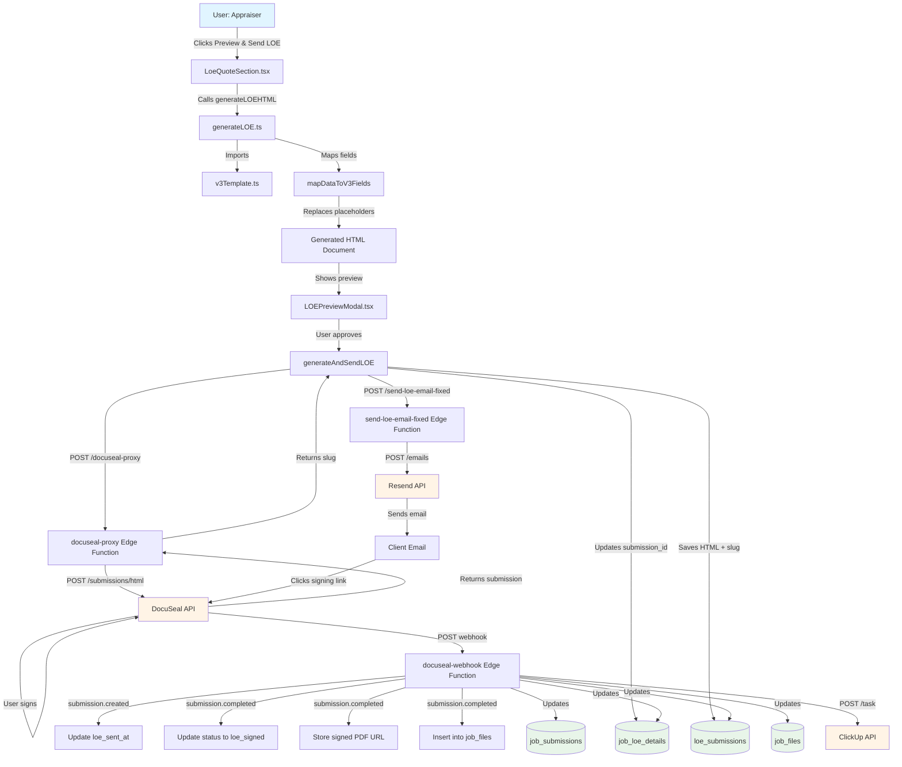

# LOE DocuSeal eSignature Component - Architecture Documentation

**Status**: Production / AUDITED & CLEANED
**Last Updated**: 2026-03-03  
**Version**: 1.0  
**Purpose**: Definitive, solitary standalone reference for the LOE DocuSeal eSignature component. (All legacy planning files have been moved to `_Archive/` to ensure this is the only file agents read).

---

## Table of Contents

1. [Executive Summary](#1-executive-summary)
2. [System Architecture Diagram](#2-system-architecture-diagram)
3. [Component Inventory](#3-component-inventory)
4. [Data Flow](#4-data-flow)
5. [Database Schema Detail](#5-database-schema-detail)
6. [Field Mapping Reference](#6-field-mapping-reference)
7. [Template Structure Analysis](#7-template-structure-analysis)
8. [DocuSeal Integration Deep Dive](#8-docuseal-integration-deep-dive)
9. [Current Limitations & Tech Debt](#9-current-limitations--tech-debt)
10. [Extension Points](#10-extension-points)

---

## 1. Executive Summary

The LOE DocuSeal eSignature component generates professional Letter of Engagement (LOE) documents from dashboard data, sends them to clients via DocuSeal's cloud API for electronic signature, and tracks signature completion through webhooks. The system uses a custom HTML template with ~20 mapped fields that are dynamically injected into placeholders, then submitted to DocuSeal with embedded signature anchor tags. Custom emails are sent via Resend API (not DocuSeal's email service) to provide better control over branding and messaging. Upon signature completion, webhooks update database tables and ClickUp tasks automatically.

**Key Integration Points**:
- **DocuSeal**: Cloud API for e-signature processing (`https://api.docuseal.com`)
- **Supabase**: Edge Functions (proxy, email, webhook) + PostgreSQL database
- **Resend API**: Custom email delivery service
- **ClickUp API**: Task management and status updates

---

## 2. System Architecture Diagram



---

## 3. Component Inventory

### 3.1 Core Generation Logic

**File**: [`src/utils/loe/generateLOE.ts`](src/utils/loe/generateLOE.ts)

**Primary Responsibility**: Generates LOE HTML documents by mapping job data to template fields and orchestrates DocuSeal submission and email sending.

**Exports**:
- `generateLOEHTML(job: DetailJob, jobDetails: JobDetails): Promise<string>` - Generates HTML without sending
- `generateAndSendLOE(job: DetailJob, jobDetails: JobDetails, htmlTemplate?: string): Promise<{success, submissionId?, signingLink?, error?}>` - Main function that generates and sends LOE
- `sendLOEEmail(clientEmail: string, clientName: string, signingLink: string, propertyAddress: string): Promise<boolean>` - Sends custom email via Edge Function

**Dependencies**:
- `@/types/job` - TypeScript types (`DetailJob`, `JobDetails`)
- `./v3Template` - HTML template constant (`V3_TEMPLATE`)
- `@/utils/testEnv` - Environment variable testing
- `@/integrations/supabase/client` - Supabase client

**Dependents**:
- `src/components/dashboard/job-details/LoeQuoteSection.tsx` - Calls `generateLOEHTML()` and `generateAndSendLOE()`
- `src/components/dashboard/job-details/actions/LOEPreviewModal.tsx` - Receives HTML from `generateLOEHTML()`

**Key Functions**:
```typescript
// Field mapping function (internal)
function mapDataToV3Fields(job: DetailJob, jobDetails: JobDetails): Record<string, string>

// HTML generation
export async function generateLOEHTML(job: DetailJob, jobDetails: JobDetails): Promise<string>

// Main orchestration function
export async function generateAndSendLOE(
  job: DetailJob, 
  jobDetails: JobDetails,
  htmlTemplate?: string
): Promise<{success: boolean, submissionId?: string, signingLink?: string, error?: string}>
```

---

### 3.2 HTML Template

**File**: [`src/utils/loe/v3Template.ts`](src/utils/loe/v3Template.ts)

**Primary Responsibility**: Stores the complete HTML template for LOE documents as a large string constant with embedded CSS, DocuSeal anchor tags, and placeholder fields.

**Exports**:
- `V3_TEMPLATE: string` - Complete HTML document template (~3-4 pages when rendered)

**Dependencies**: None (pure constant)

**Dependents**:
- `src/utils/loe/generateLOE.ts` - Imports `V3_TEMPLATE` for field injection

**Template Characteristics**:
- Embedded CSS styling for professional appearance
- DocuSeal anchor tags: `<signature-field role="First Party">` and `<date-field role="First Party">`
- ~20 bracketed placeholders: `[date.created]`, `[fee]`, `[propertycontact.company]`, etc.
- Hardcoded legal terms and conditions section
- Company branding and footer information

---

### 3.3 UI Component

**File**: [`src/components/dashboard/job-details/LoeQuoteSection.tsx`](src/components/dashboard/job-details/LoeQuoteSection.tsx)

**Primary Responsibility**: React component that displays LOE quote section in dashboard, handles user interactions for generating and sending LOE documents.

**Exports**:
- `LoeQuoteSection` (default export) - React functional component

**Dependencies**:
- `@/components/ui/*` - Shadcn UI components (Button, Input, Select, Textarea, Collapsible, Tooltip)
- `@/utils/loe/generateLOE` - `generateLOEHTML`, `generateAndSendLOE`, `sendLOEEmail`
- `@/utils/webhooks/docuseal` - `validateRequiredFields`
- `@/utils/webhooks/clickup` - `markLOEPrepComplete`
- `@/components/dashboard/job-details/actions/LOEPreviewModal` - Preview modal component
- `@/integrations/supabase/client` - Supabase client
- `@/types/job` - TypeScript types

**Dependents**:
- Parent dashboard component (imports and renders `LoeQuoteSection`)

**Key User Interactions**:
- "Preview & Send LOE" button → Calls `handleGeneratePreview()` → Opens `LOEPreviewModal`
- Preview modal → User approves → Calls `handleApproveAndSend()` → Calls `generateAndSendLOE()`
- Auto-save functionality for LOE detail fields
- Valcre job creation integration

---

### 3.4 DocuSeal Proxy Edge Function

**File**: [`supabase/functions/docuseal-proxy/index.ts`](supabase/functions/docuseal-proxy/index.ts)

**Primary Responsibility**: Supabase Edge Function that acts as a proxy between client and DocuSeal API, keeping API keys server-side.

**Exports**: None (Edge Function handler)

**Dependencies**:
- `https://deno.land/std@0.168.0/http/server.ts` - Deno HTTP server

**Dependents**:
- `src/utils/loe/generateLOE.ts` - Calls proxy endpoint: `/functions/v1/docuseal-proxy?endpoint=submissions/html`

**Configuration**:
- Environment Variable: `DOCUSEAL_API_KEY` (stored in Supabase Edge Function secrets)
- Endpoint Pattern: `?endpoint=submissions/html` (appended to DocuSeal base URL)
- Authentication: `X-Auth-Token` header with API key

**Functionality**:
- Receives POST requests from client
- Extracts `endpoint` query parameter
- Forwards request to `https://api.docuseal.com/{endpoint}`
- Adds `X-Auth-Token` header
- Returns DocuSeal response to client
- Handles CORS preflight requests

---

### 3.5 Email Sending Edge Function

**File**: [`supabase/functions/send-loe-email-fixed/index.ts`](supabase/functions/send-loe-email-fixed/index.ts)

**Primary Responsibility**: Supabase Edge Function that sends custom LOE emails via Resend API with signing link.

**Exports**: None (Edge Function handler)

**Dependencies**:
- `https://deno.land/std@0.220.0/http/server.ts` - Deno HTTP server

**Dependents**:
- `src/utils/loe/generateLOE.ts` - Calls via `sendLOEEmail()` function

**Configuration**:
- Environment Variable: `RESEND_API_KEY` (stored in Supabase Edge Function secrets)
- From Address: `Valta Appraisals <onboarding@resend.dev>` (sandbox domain for testing)

**Functionality**:
- Receives POST request with: `{ to, clientName, signingLink, propertyAddress }`
- Generates HTML email template with signing button
- Sends email via Resend API
- Returns success/error response

**Email Template Structure**:
- Professional HTML email
- Greeting with client name
- Property address reference
- Signing button linking to DocuSeal slug URL
- "What happens next" bullet points
- Company contact information footer

---

### 3.6 Webhook Handler Edge Function

**File**: [`supabase/functions/docuseal-webhook/index.ts`](supabase/functions/docuseal-webhook/index.ts)

**Primary Responsibility**: Supabase Edge Function that receives DocuSeal webhook events and updates database tables and ClickUp tasks accordingly.

**Exports**: None (Edge Function handler)

**Dependencies**:
- `jsr:@supabase/functions-js/edge-runtime.d.ts` - Edge runtime types
- `jsr:@supabase/supabase-js@2` - Supabase client

**Dependents**:
- DocuSeal webhook configuration (configured in DocuSeal dashboard)

**Configuration**:
- Webhook URL: `https://[project-ref].supabase.co/functions/v1/docuseal-webhook`
- Events: `submission.created`, `submission.completed`
- Environment Variables: `SUPABASE_URL`, `SUPABASE_SERVICE_ROLE_KEY`, `CLICKUP_API_TOKEN`

**Functionality**:
- Handles `submission.created` event:
  - Updates `job_loe_details.loe_sent_at`
  - Updates ClickUp task with "LOE Sent" timestamp
- Handles `submission.completed` event:
  - Updates `job_submissions.status` to `'loe_signed'`
  - Stores `signed_document_url` in `job_loe_details`
  - Inserts signed document into `job_files` table
  - Updates ClickUp task with "LOE Signed" timestamp and signer name

**Helper Functions**:
- `updateClickUpLOEStatus()` - Formats timestamp and updates ClickUp task description

---

## 4. Data Flow

### 4.1 User Initiation

**Trigger**: User clicks "Preview & Send LOE" button in `LoeQuoteSection.tsx`

**Validation**:
- `validateRequiredFields(job, jobDetails)` checks for required fields
- Validates: `clientEmail`, `clientFirstName`, `clientLastName`, `propertyAddress`, `appraisalFee`, `scopeOfWork`, `valuationPremises`
- Button is disabled if validation fails

**UI Flow**:
```
User clicks button
  ↓
handleGeneratePreview() called
  ↓
generateLOEHTML(job, jobDetails) called
  ↓
HTML returned and set in state
  ↓
LOEPreviewModal opens with preview
```

**Code Reference**: `LoeQuoteSection.tsx` lines 586-627

---

### 4.2 Data Gathering

**Source Tables**:
- `job_submissions` - Provides `DetailJob` object with client/property information
- `job_loe_details` - Provides `JobDetails` object with LOE-specific fields

**Data Loading**:
- Data loaded via Supabase client in parent dashboard component
- Passed as props to `LoeQuoteSection` component
- Includes: `job` (DetailJob) and `jobDetails` (JobDetails)

**Key Fields Used**:
- From `job`: `clientEmail`, `clientFirstName`, `clientLastName`, `clientOrganization`, `propertyAddress`, `intendedUse`, etc.
- From `jobDetails`: `jobNumber`, `appraisalFee`, `retainerAmount`, `paymentTerms`, `deliveryDate`, `scopeOfWork`, `valuationPremises`, `reportType`, etc.

---

### 4.3 HTML Generation

**Function**: `generateLOEHTML(job: DetailJob, jobDetails: JobDetails): Promise<string>`

**Step-by-Step Process**:

1. **Load Template**:
   ```typescript
   let templateHTML = await loadV3Template(); // Returns V3_TEMPLATE from v3Template.ts
   ```

2. **Map Fields**:
   ```typescript
   const fieldMappings = mapDataToV3Fields(job, jobDetails);
   // Returns object like: { '[date.created]': 'January 20, 2026', '[fee]': '$5,000', ... }
   ```

3. **Replace Placeholders**:
   ```typescript
   for (const [field, value] of Object.entries(fieldMappings)) {
     const escapedField = field.replace(/[.*+?^${}()|[\]\\]/g, '\\$&');
     templateHTML = templateHTML.replace(
       new RegExp(escapedField, 'g'), 
       value as string
     );
   }
   ```

4. **Return HTML**:
   - Returns complete HTML string with all placeholders replaced
   - DocuSeal anchor tags remain untouched: `<signature-field>`, `<date-field>`

**Code Reference**: `generateLOE.ts` lines 81-104

---

### 4.4 Field Injection

**Function**: `mapDataToV3Fields(job: DetailJob, jobDetails: JobDetails): Record<string, string>`

**Mapping Logic**:
- Takes `job` and `jobDetails` objects as input
- Returns object with ~20 key-value pairs
- Keys are bracketed placeholders: `'[date.created]'`, `'[fee]'`, etc.
- Values are formatted strings from job/jobDetails data

**Field Categories**:
1. **Date Fields**: `[date.created]` - Generated from current date
2. **Client Contact**: `[propertycontact.*]` - From `job` object
3. **Property Details**: `[name]`, `[addressstreet]` - From `job` and `jobDetails`
4. **Appraisal Details**: `[purposes]`, `[requestedvalues]`, `[propertyrights]`, `[reportformat]`
5. **Financial**: `[fee]`, `[retainer]`, `[paymentterms]` - Currency formatted
6. **Administrative**: `[scopes]`, `[duedate]`, `[jobnumber]`, `[notes]`

**Formatting Examples**:
- Currency: `jobDetails.appraisalFee` → `"$5,000"` (with `toLocaleString()`)
- Date: `new Date()` → `"January 20, 2026"` (formatted with `toLocaleDateString()`)
- Fallbacks: `job.clientOrganization || 'Not Specified'`

**Code Reference**: `generateLOE.ts` lines 23-76

---

### 4.5 DocuSeal Submission

**Endpoint**: `/functions/v1/docuseal-proxy?endpoint=submissions/html`

**Request Flow**:
```
generateAndSendLOE()
  ↓
POST to docuseal-proxy Edge Function
  ↓
Proxy forwards to https://api.docuseal.com/submissions/html
  ↓
DocuSeal API processes HTML and returns submission data
  ↓
Proxy returns response to client
```

**Payload Structure**:
```typescript
{
  name: `LOE-${job.jobNumber || Date.now()}`,
  send_email: false, // CRITICAL: We send our own email
  documents: [{
    name: 'letter-of-engagement',
    html: templateHTML, // Complete HTML with anchor tags
    size: 'Letter' // 8.5" x 11"
  }],
  submitters: [{
    email: clientEmail,
    name: clientName,
    role: 'First Party' // Must match anchor tag roles!
  }]
}
```

**Response Structure**:
```typescript
{
  id: "123456", // DocuSeal submission ID
  slug: "abc123xyz789", // Signing URL slug
  status: "pending",
  submitters: [{
    slug: "abc123xyz789" // Signing slug
  }]
}
```

**Storage Operations**:
1. Insert into `loe_submissions`:
   - `job_id`, `client_name`, `client_email`
   - `loe_html` (complete HTML document)
   - `docuseal_slug`, `docuseal_submission_id`
   - `status: 'pending'`

2. Update `job_loe_details`:
   - `docuseal_submission_id` = submission ID

**Code Reference**: `generateLOE.ts` lines 164-258

---

### 4.6 Email Sending

**Function**: `send-loe-email-fixed` Edge Function

**Request Flow**:
```
generateAndSendLOE()
  ↓
Calls sendLOEEmail() helper
  ↓
POST to /functions/v1/send-loe-email-fixed
  ↓
Edge Function calls Resend API
  ↓
Email sent to client
```

**Payload to Edge Function**:
```typescript
{
  to: clientEmail,
  clientName: `${job.clientFirstName} ${job.clientLastName}`,
  signingLink: `https://docuseal.com/s/${docusealSlug}`,
  propertyAddress: job.propertyAddress
}
```

**Email Content**:
- Subject: "Letter of Engagement - Ready for Signature"
- HTML body with:
  - Greeting with client name
  - Property address reference
  - Signing button (links to DocuSeal slug URL)
  - "What happens next" instructions
  - Company contact information

**Signing Link Generation**:
- Primary: `${window.location.origin}/sign/${loeSubmission.id}` (custom route)
- Fallback: `https://docuseal.com/s/${docusealSlug}` (direct DocuSeal URL)

**Code Reference**: 
- `generateLOE.ts` lines 260-290
- `send-loe-email-fixed/index.ts` lines 14-97

---

### 4.7 Webhook Receipt

**Endpoint**: `/functions/v1/docuseal-webhook`

**Configuration**:
- Configured in DocuSeal dashboard
- URL: `https://[project-ref].supabase.co/functions/v1/docuseal-webhook`
- Events: `submission.created`, `submission.completed`

**Webhook Payload Structure**:
```typescript
{
  event_type: 'submission.created' | 'submission.completed',
  data: {
    id: string, // DocuSeal submission ID
    status: string,
    email: string,
    created_at: string,
    completed_at?: string,
    submitters?: Array<{
      name?: string,
      email?: string
    }>,
    documents?: Array<{
      id: string,
      name: string,
      url: string // Signed PDF URL
    }>,
    metadata?: {
      job_id?: string,
      clickup_task_id?: string
    }
  }
}
```

**Handler Logic**:
1. Parse webhook payload
2. Initialize Supabase client with service role key
3. Route to appropriate handler based on `event_type`
4. Look up job by `docuseal_submission_id` or `metadata.job_id`
5. Update database tables
6. Update ClickUp task (if `clickup_task_id` exists)
7. Return success response

**Code Reference**: `docuseal-webhook/index.ts` lines 166-433

---

### 4.8 Status Updates

#### submission.created Event

**Database Updates**:
```typescript
// Update loe_sent_at timestamp
await supabase
  .from('job_loe_details')
  .update({ loe_sent_at: payload.data.created_at })
  .eq('job_id', jobId)
```

**ClickUp Updates**:
- Updates task description with "LOE Sent" timestamp
- Format: `"▸ LOE Sent:   26.01.20 / 2:30 PM"`
- Uses `updateClickUpLOEStatus(taskId, 'sent', timestamp)`

**Code Reference**: `docuseal-webhook/index.ts` lines 182-270

#### submission.completed Event

**Database Updates**:
```typescript
// 1. Update job status
await supabase
  .from('job_submissions')
  .update({ 
    status: 'loe_signed',
    updated_at: new Date().toISOString()
  })
  .eq('id', jobId)

// 2. Store signed document URL
await supabase
  .from('job_loe_details')
  .update({
    signed_document_url: signedDocument.url,
    signed_at: payload.data.completed_at
  })
  .eq('job_id', jobId)

// 3. Update loe_submissions status
await supabase
  .from('loe_submissions')
  .update({ status: 'signed', signed_at: completedAt })
  .eq('docuseal_submission_id', submissionId)
```

**ClickUp Updates**:
- Updates task description with "LOE Signed" timestamp and signer name
- Format: `"▸ LOE Signed: 26.01.20 / 3:45 PM by John Smith"`
- Uses `updateClickUpLOEStatus(taskId, 'signed', timestamp, signerName)`

**Code Reference**: `docuseal-webhook/index.ts` lines 273-408

---

### 4.9 Signed Document Storage

**Storage Locations**:

1. **Primary Storage**: `job_loe_details.signed_document_url`
   - Column: `signed_document_url` (TEXT)
   - Value: URL to signed PDF from DocuSeal
   - Updated on `submission.completed` event

2. **File Management System**: `job_files` table
   ```typescript
   await supabase
     .from('job_files')
     .insert({
       job_id: jobId,
       file_name: signedDocument.name || 'Signed LOE Agreement',
       file_type: 'application/pdf',
       storage_path: signedDocument.url, // DocuSeal URL
       category: 'signed_agreement',
       is_client_visible: true
     })
   ```

**Document URL Source**:
- Extracted from webhook payload: `payload.data.documents[0].url`
- This is a DocuSeal-hosted URL (not stored in Supabase Storage)
- URL provides direct access to signed PDF

**Code Reference**: `docuseal-webhook/index.ts` lines 344-373

---

## 5. Database Schema Detail

### 5.1 `job_submissions` Table

**Purpose**: Main job record storing client/property information and overall job status.

**Key Columns**:
```sql
id UUID PRIMARY KEY
client_first_name TEXT
client_last_name TEXT
client_email TEXT
client_phone TEXT
client_organization TEXT
property_name TEXT
property_address TEXT
property_type TEXT
intended_use TEXT
status TEXT DEFAULT 'pending_loe'
clickup_task_id TEXT
clickup_task_url TEXT
created_at TIMESTAMP DEFAULT NOW()
updated_at TIMESTAMP DEFAULT NOW()
```

**Status Values**:
- `'pending_loe'` - Initial state after form submission
- `'loe_sent'` - LOE generated and email sent (not currently set by system)
- `'loe_signed'` - Client completed signature (set by webhook)
- `'payment_pending'` - Manual update or future payment integration
- `'job_in_progress'` - After payment received
- `'completed'` - After appraisal report delivered

**Write Operations**:
- **Created**: On form submission (Stage 1)
- **Updated**: 
  - By webhook on `submission.completed` → Sets `status = 'loe_signed'`
  - Manual updates for other status changes

**Foreign Key Relationships**: None (top-level table)

---

### 5.2 `job_loe_details` Table

**Purpose**: Stores LOE-specific data and DocuSeal integration metadata.

**Key Columns**:
```sql
id UUID PRIMARY KEY
job_id UUID REFERENCES job_submissions(id) ON DELETE CASCADE
job_number TEXT -- VAL number (e.g., "VAL251999")
valcre_job_id INTEGER -- Valcre internal ID
appraisal_fee NUMERIC
retainer_amount TEXT -- Stored as string
payment_terms TEXT
delivery_date DATE
scope_of_work TEXT
valuation_premises TEXT
property_rights_appraised TEXT
report_type TEXT
internal_comments TEXT
delivery_comments TEXT
payment_comments TEXT
docuseal_submission_id TEXT -- DocuSeal submission ID
signed_document_url TEXT -- URL to signed PDF
signed_at TIMESTAMP
loe_sent_at TIMESTAMP
clickup_task_id TEXT
clickup_task_url TEXT
created_at TIMESTAMP DEFAULT NOW()
updated_at TIMESTAMP DEFAULT NOW()
```

**Foreign Key Relationships**:
- `job_id` → `job_submissions.id` (CASCADE DELETE)

**Write Operations**:
- **Created**: When appraiser fills LOE details (Stage 2)
- **Updated**: 
  - Auto-save on field changes
  - By `generateAndSendLOE()` → Sets `docuseal_submission_id`
  - By webhook on `submission.created` → Sets `loe_sent_at`
  - By webhook on `submission.completed` → Sets `signed_document_url`, `signed_at`

**Status Tracking**: Uses `job_submissions.status` for overall status; this table stores LOE-specific timestamps.

---

### 5.3 `loe_submissions` Table

**Purpose**: Tracks each DocuSeal submission with complete HTML document for audit/re-send capability.

**Key Columns**:
```sql
id UUID PRIMARY KEY DEFAULT gen_random_uuid()
job_id TEXT NOT NULL -- Job identifier (job_number or UUID)
client_name TEXT NOT NULL
client_email TEXT NOT NULL
loe_html TEXT NOT NULL -- Complete V3-LOE with all fields filled
docuseal_slug TEXT NOT NULL -- DocuSeal signing slug
docuseal_submission_id TEXT -- DocuSeal submission ID
status TEXT DEFAULT 'pending' -- 'pending', 'signed', 'expired'
created_at TIMESTAMP DEFAULT NOW()
signed_at TIMESTAMP
UNIQUE(job_id)
```

**Status Values**:
- `'pending'` - LOE sent but not yet signed
- `'signed'` - Client completed signature (updated by webhook)
- `'expired'` - DocuSeal submission expired (manual update)

**Write Operations**:
- **Created**: By `generateAndSendLOE()` when LOE is sent
  - Stores complete `loe_html` for document recreation
  - Stores `docuseal_slug` for signing URL generation
- **Updated**: 
  - By webhook on `submission.completed` → Sets `status = 'signed'`, `signed_at`

**Design Rationale**:
- Stores complete HTML to enable document recreation without regenerating
- Provides audit trail of what client actually signed
- Supports resending if needed (can use stored HTML)

**Foreign Key Relationships**: None (uses `job_id` as TEXT, not FK)

---

### 5.4 `job_files` Table

**Purpose**: General file management system for jobs, including signed documents.

**Key Columns**:
```sql
id UUID PRIMARY KEY DEFAULT uuid_generate_v4()
job_id UUID REFERENCES job_submissions(id) ON DELETE CASCADE
file_name VARCHAR NOT NULL
file_type VARCHAR -- 'application/pdf'
file_size INTEGER
storage_path VARCHAR -- DocuSeal URL for signed documents
category VARCHAR -- 'client_upload', 'signed_agreement', 'research_doc'
is_client_visible BOOLEAN DEFAULT true
created_at TIMESTAMP DEFAULT NOW()
```

**Foreign Key Relationships**:
- `job_id` → `job_submissions.id` (CASCADE DELETE)

**Write Operations**:
- **Inserted**: By webhook on `submission.completed` event
  - `file_name`: "Signed LOE Agreement"
  - `storage_path`: DocuSeal URL from webhook payload
  - `category`: `'signed_agreement'`
  - `is_client_visible`: `true`

**Usage**: Provides unified file management interface for all job-related documents, including signed LOEs.

---

## 6. Field Mapping Reference

| Placeholder | Source | Example Value | Notes |
|------------|--------|---------------|-------|
| `[date.created]` | Generated | `"January 20, 2026"` | Current date formatted with `toLocaleDateString('en-US', {year: 'numeric', month: 'long', day: 'numeric'})` |
| `[propertycontact.company]` | `job.clientOrganization` | `"ABC Corporation"` | Fallback: `'Not Specified'` |
| `[propertycontact.firstname]` | `job.clientFirstName` | `"John"` | Fallback: `''` (empty string) |
| `[propertycontact.lastname]` | `job.clientLastName` | `"Smith"` | Fallback: `''` (empty string) |
| `[propertycontact.title]` | `job.clientTitle` | `"CEO"` | Fallback: `'Not Specified'` |
| `[propertycontact.addressstreet]` | `job.clientAddress` | `"123 Main St"` | Fallback: `'Not Specified'` |
| `[name]` | `jobDetails.jobNumber` | `"VAL251999"` | Fallback: `'PENDING-' + Date.now().toString().slice(-6)` |
| `[addressstreet]` | `job.propertyAddress` | `"456 Oak Avenue"` | Fallback: `'Property Address Not Specified'` |
| `[purposes]` | `job.intendedUse` | `"Mortgage Lending"` | Fallback: `'Not Specified'` |
| `[intendeduses]` | `job.intendedUse` | `"Mortgage Lending"` | Same as `[purposes]`, fallback: `'Not Specified'` |
| `[requestedvalues]` | `jobDetails.valuationPremises` | `"Market Value"` | Fallback: `'Market Value'` |
| `[propertyrights]` | `jobDetails.propertyRightsAppraised` | `"Fee Simple Interest"` | Fallback: `'Fee Simple'` |
| `[reportformat]` | `jobDetails.reportType` | `"Full Narrative Report"` | Fallback: `'Full Narrative Report'` |
| `[fee]` | `jobDetails.appraisalFee` | `"$5,000"` | Currency formatted with `toLocaleString()`, fallback: `'$TBD'` |
| `[retainer]` | `jobDetails.retainerAmount` | `"$500"` | Currency formatted, fallback: `'$TBD'` |
| `[paymentterms]` | `jobDetails.paymentTerms` | `"On LOE Signature"` | Fallback: `'Net 30 days'` |
| `[scopes]` | `jobDetails.scopeOfWork` | `"All Applicable"` | Fallback: `'All Applicable'` |
| `[duedate]` | `jobDetails.deliveryDate` | `"2026-02-15"` | Date string, fallback: `'15 business days'` |
| `[jobnumber]` | `jobDetails.jobNumber` | `"VAL251999"` | Same as `[name]`, fallback: `'PENDING-' + Date.now().toString().slice(-6)` |
| `[notes]` | `job.notes \|\| jobDetails.specialInstructions` | `"Rush appraisal requested"` | Cascading fallback, final fallback: `''` (empty string) |

**Total Fields**: 20 mapped fields

**Field Replacement Logic**:
- All fields use global regex replacement: `templateHTML.replace(new RegExp(escapedField, 'g'), value)`
- Fields are escaped for regex: `field.replace(/[.*+?^${}()|[\]\\]/g, '\\$&')`
- Multiple occurrences of same placeholder are replaced (global flag)

**Code Reference**: `generateLOE.ts` lines 23-76, 92-98

---

### 6.1 Complete Field Mapping Enumeration

Complete numbered enumeration of ALL field mappings from `mapDataToV3Fields()` function:

| # | Placeholder | Source Path | Type | Fallback | Example Output |
|---|-------------|-------------|------|----------|----------------|
| 1 | `[date.created]` | Generated via `new Date().toLocaleDateString()` | String | N/A (always generated) | `"January 20, 2026"` |
| 2 | `[propertycontact.company]` | `job.clientOrganization` | String | `'Not Specified'` | `"ABC Corporation"` |
| 3 | `[propertycontact.firstname]` | `job.clientFirstName` | String | `''` (empty string) | `"John"` |
| 4 | `[propertycontact.lastname]` | `job.clientLastName` | String | `''` (empty string) | `"Smith"` |
| 5 | `[propertycontact.title]` | `job.clientTitle` | String | `'Not Specified'` | `"CEO"` |
| 6 | `[propertycontact.addressstreet]` | `job.clientAddress` | String | `'Not Specified'` | `"123 Main St"` |
| 7 | `[name]` | `jobDetails.jobNumber` | String | `'PENDING-' + Date.now().toString().slice(-6)` | `"VAL251999"` |
| 8 | `[addressstreet]` | `job.propertyAddress` | String | `'Property Address Not Specified'` | `"456 Oak Avenue"` |
| 9 | `[purposes]` | `job.intendedUse` | String | `'Not Specified'` | `"Mortgage Lending"` |
| 10 | `[intendeduses]` | `job.intendedUse` | String | `'Not Specified'` | `"Mortgage Lending"` |
| 11 | `[requestedvalues]` | `jobDetails.valuationPremises` | String | `'Market Value'` | `"Market Value"` |
| 12 | `[propertyrights]` | `jobDetails.propertyRightsAppraised` | String | `'Fee Simple'` | `"Fee Simple Interest"` |
| 13 | `[reportformat]` | `jobDetails.reportType` | String | `'Full Narrative Report'` | `"Full Narrative Report"` |
| 14 | `[fee]` | `jobDetails.appraisalFee` | String (currency formatted) | `'$TBD'` | `"$5,000"` |
| 15 | `[scopes]` | `jobDetails.scopeOfWork` | String | `'All Applicable'` | `"All Applicable"` |
| 16 | `[duedate]` | `jobDetails.deliveryDate` | String | `'15 business days'` | `"2026-02-15"` |
| 17 | `[jobnumber]` | `jobDetails.jobNumber` | String | `'PENDING-' + Date.now().toString().slice(-6)` | `"VAL251999"` |
| 18 | `[paymentterms]` | `jobDetails.paymentTerms` | String | `'Net 30 days'` | `"On LOE Signature"` |
| 19 | `[retainer]` | `jobDetails.retainerAmount` | String (currency formatted) | `'$TBD'` | `"$500"` |
| 20 | `[notes]` | `job.notes \|\| jobDetails.specialInstructions` | String (cascading fallback) | `''` (empty string) | `"Rush appraisal requested"` |

**Total**: 20 field mappings

**Code Reference**: `generateLOE.ts` lines 37-75

---

### 6.2 Function Signatures

Exact TypeScript function signatures extracted from source files:

#### File: `src/utils/loe/generateLOE.ts`

```typescript
// Internal helper function
async function loadV3Template(): Promise<string>

// Internal mapping function
function mapDataToV3Fields(job: DetailJob, jobDetails: JobDetails): Record<string, string>

// Exported functions
export async function generateLOEHTML(
  job: DetailJob,
  jobDetails: JobDetails
): Promise<string>

export async function generateAndSendLOE(
  job: DetailJob, 
  jobDetails: JobDetails,
  htmlTemplate?: string
): Promise<{
  success: boolean;
  submissionId?: string;
  signingLink?: string;
  error?: string;
}>

export async function sendLOEEmail(
  clientEmail: string,
  clientName: string,
  signingLink: string,
  propertyAddress: string
): Promise<boolean>

// Internal helper (not exported)
async function updateJobWithDocuSeal(jobId: string, submissionId: string): Promise<void>
```

#### File: `src/utils/loe/v3Template.ts`

```typescript
// Exported constant
export const V3_TEMPLATE: string
```

**Code Reference**: 
- `generateLOE.ts` lines 14-17, 23-76, 81-104, 110-305, 330-377
- `v3Template.ts` line 8

---

### 6.3 TypeScript Interfaces

Relevant interfaces from `src/types/job.ts` used by LOE component:

```typescript
// File: src/types/job.ts

export interface DetailJob extends JobSubmission {
  files?: JobFile[];
  clickup_task_id?: string; // Database naming convention
  clickup_task_url?: string; // Database naming convention
}

export interface JobSubmission {
  id: string;
  clientFirstName: string;
  clientLastName: string;
  clientEmail: string;
  clientPhone: string;
  clientTitle?: string;
  clientOrganization?: string;
  clientAddress?: string;
  propertyAddress: string;
  propertyName?: string;
  propertyType?: string; // Legacy single-select
  propertyTypes?: string[]; // New multi-select array
  intendedUse?: string;
  assetCondition?: string;
  notes?: string;
  // Property Contact fields
  propertyContactFirstName?: string;
  propertyContactLastName?: string;
  propertyContactEmail?: string;
  propertyContactPhone?: string;
  sameAsClientContact?: boolean;
  status: JobStatus;
  createdAt: string;
  jobNumber?: string;
  clickupTaskId?: string;
  clickupTaskUrl?: string;
  files?: JobFile[];
}

export interface JobDetails {
  // Section 2: LOE Quote Preparation
  jobNumber?: string;
  valcreJobId?: string;
  valcre_job_id?: string; // Alternative naming for database field
  docusealSubmissionId?: string;
  docuseal_submission_id?: string; // Alternative naming for database field
  propertyRightsAppraised?: string;
  valuationPremises?: string;
  deliveryDate?: string;
  scopeOfWork?: string;
  specialInstructions?: string;
  reportType?: string;
  paymentTerms?: string;
  appraisalFee?: number;
  retainerAmount?: string;
  disbursementPercentage?: string;
  internalComments?: string;
  
  // Section 3A: Organizing Client Docs
  yearBuilt?: string;
  buildingSize?: string;
  legalDescription?: string;
  numberOfUnits?: number;
  parkingSpaces?: number;
  
  // Section 3B: Pulling Property Info - Research
  zoningClassification?: string;
  zoneAbbreviation?: string;
  landUseDesignation?: string;
  floodZone?: string;
  utilities?: string;
  parcelNumber?: string;
  usableLandSf?: number;
  usableLandAcres?: number;
  grossLandSf?: number;
  grossLandAcres?: number;
  assessedValue?: number;
  taxes?: number;
  assessmentYear?: string;
  landAssessmentValue?: number;
  improvedAssessmentValue?: number;
  totalAssessmentValue?: number;
}

export type JobStatus = 
  | "submitted" 
  | "in_progress" 
  | "loe_pending"
  | "loe_sent"
  | "loe_signed"
  | "contract_generated"
  | "paid"
  | "active" 
  | "completed";
```

**Properties Used by LOE Component**:

**From `DetailJob` (via `JobSubmission`)**:
- `id`, `clientFirstName`, `clientLastName`, `clientEmail`, `clientPhone`
- `clientTitle`, `clientOrganization`, `clientAddress`
- `propertyAddress`, `propertyName`, `propertyType`, `intendedUse`
- `notes`, `jobNumber`

**From `JobDetails`**:
- `jobNumber`, `appraisalFee`, `retainerAmount`, `paymentTerms`
- `deliveryDate`, `scopeOfWork`, `valuationPremises`
- `propertyRightsAppraised`, `reportType`, `specialInstructions`

**Code Reference**: `src/types/job.ts` lines 1-101

---

## 7. Template Structure Analysis

### 7.1 Page Structure

The `V3_TEMPLATE` is a complete HTML document that renders to approximately 3-4 pages when printed or viewed as PDF.

#### Page 1: Header and Introduction

**Content**:
- **Document Header**: Logo placeholder (base64 embedded image), company address block, date
- **Subject Line**: "Re: Letter of Engagement... for [name], [addressstreet]"
- **Introduction Paragraph**: Greeting and purpose statement

**Fields Used**:
- `[date.created]` - Document date
- `[propertycontact.company]`, `[propertycontact.firstname]`, `[propertycontact.lastname]`, `[propertycontact.title]`, `[propertycontact.addressstreet]` - Client contact info
- `[name]`, `[addressstreet]` - Property identification

**Classification**: Mix of static (company info, greeting text) and dynamic (all bracketed fields)

#### Page 1-2: Property Details Tables

**Content**:
- **First Table**: Property identification, type, authorized client/users, authorized use, effective date, value type, property rights
- **Second Table**: Report type, fee, scope of work, delivery date

**Fields Used**:
- `[name]`, `[addressstreet]` - Property identification
- `[purposes]` - Property type
- `[propertycontact.company]` - Authorized client
- `[intendeduses]` - Authorized use
- `[requestedvalues]` - Value to be appraised
- `[propertyrights]` - Property rights appraised
- `[reportformat]` - Report type
- `[fee]` - Fee amount
- `[scopes]` - Scope of work
- `[duedate]` - Delivery date

**Classification**: Mostly dynamic (all table values are fields), static table structure

#### Page 2-3: Signature Section

**Content**:
- **Signature Container**: Client's acceptance section
- **Signature Fields**: DocuSeal anchor tags for signature and date
- **Signed By Field**: Client name and title

**DocuSeal Anchor Tags**:
```html
<signature-field 
  name="Client Signature" 
  role="First Party" 
  required="true"
  page="0"
  x="50"
  y="700"
  width="200"
  height="50">
</signature-field>

<date-field 
  name="Signature Date" 
  role="First Party" 
  required="true"
  page="0"
  x="300"
  y="700"
  width="100"
  height="30">
</date-field>
```

**Fields Used**:
- `[propertycontact.firstname]`, `[propertycontact.lastname]`, `[propertycontact.title]` - Signed by field

**Classification**: Dynamic (client name), static (signature field structure), DocuSeal tags (converted to interactive fields)

#### Page 3-4: Terms & Conditions

**Content**:
- **Section Divider**: "Terms & Conditions" header
- **Terms List**: Numbered list of legal terms and conditions
- **Sub-items**: Lettered sub-items under main terms

**Fields Used**: None (fully static)

**Classification**: Fully static (hardcoded legal text)

#### Page 4: Footer

**Content**:
- Company name: "Valta Property Valuations Ltd."
- Address: "#300-4838 Richard Road SW, Calgary, AB T3E 6L1"
- Contact information: Phone, email, website

**Fields Used**: None (fully static)

**Classification**: Fully static (hardcoded company info)

---

### 7.2 Content Classification

#### Fully Static (Never Change)
- Company information (header and footer)
- Legal terms and conditions section
- Document structure and CSS styling
- Signature field labels and structure (not the interactive fields themselves)

#### Dynamic via Field Mapping (Currently)
- All bracketed placeholders: `[date.created]`, `[fee]`, `[propertycontact.*]`, etc.
- Property details table values
- Client name in signature section

#### Candidates for User-Editable (Future Enhancement)
- **Introduction paragraph**: Currently has some dynamic fields but structure is static
- **Terms & Conditions section**: Fully static, could be made editable with versioning
- **Footer company info**: Static, could be configurable
- **Email template**: Currently hardcoded in Edge Function, could be database-driven

---

### 7.3 DocuSeal Anchor Tags Explained

**Purpose**: DocuSeal scans HTML documents for special anchor tags and converts them to interactive signature/date fields.

**Tag Types**:

1. **Signature Field**:
   ```html
   <signature-field role="First Party" required="true"></signature-field>
   ```
   - Converts to interactive signature pad
   - Client can draw signature or upload image
   - Role must match `submitters[].role` in submission payload

2. **Date Field**:
   ```html
   <date-field role="First Party" required="true"></date-field>
   ```
   - Converts to date picker
   - Client selects date from calendar
   - Role must match `submitters[].role` in submission payload

**Role Matching**:
- Anchor tag `role="First Party"` must match submitter `role: "First Party"` in DocuSeal payload
- This ensures the correct person sees the correct fields

**Positioning**:
- Tags can include positioning attributes: `page`, `x`, `y`, `width`, `height`
- If not specified, DocuSeal auto-positions fields
- Current template uses auto-positioning

**Code Reference**: `v3Template.ts` (signature section), `generateLOE.ts` lines 137-144 (validation)

---

### 7.4 DocuSeal Anchor Tag Complete Reference

Complete HTML syntax for all DocuSeal anchor tags used in the template:

#### Signature Field Tag

```html
<signature-field 
  name="Client Signature" 
  role="First Party" 
  required="true"
  align="left"
  style="width: 160px; height: 50px; border: none; display: block; margin-left: 0;">
</signature-field>
```

**Attributes**:
- `name`: Field identifier displayed in DocuSeal UI (`"Client Signature"`)
- `role`: Must match `submitters[].role` in API payload (`"First Party"`)
- `required`: Whether field is mandatory (`"true"` or `"false"`)
- `align`: Text alignment (`"left"`, `"center"`, `"right"`)
- `style`: Inline CSS for positioning and sizing

**Behavior**: Converts to interactive signature pad where client can:
- Draw signature with mouse/touch
- Upload signature image file
- Type name as text signature

#### Date Field Tag

```html
<date-field 
  name="Signature Date" 
  role="First Party" 
  required="true"
  style="width: 160px; height: 30px; border: none; display: block; margin-left: 0;">
</date-field>
```

**Attributes**:
- `name`: Field identifier displayed in DocuSeal UI (`"Signature Date"`)
- `role`: Must match `submitters[].role` in API payload (`"First Party"`)
- `required`: Whether field is mandatory (`"true"` or `"false"`)
- `style`: Inline CSS for positioning and sizing

**Behavior**: Converts to interactive date picker where client selects date from calendar.

#### Role Mapping

**Critical**: The `role` attribute in anchor tags must exactly match the `role` property in the DocuSeal submission payload:

```typescript
// In generateLOE.ts submission payload
submitters: [{
  email: clientEmail,
  name: clientName,
  role: 'First Party' // ← Must match anchor tag role="First Party"
}]
```

**Current Implementation**: All anchor tags use `role="First Party"` to match the single submitter in the payload.

#### Other Supported Anchor Tags (Not Currently Used)

DocuSeal supports additional anchor tags that are not used in the current template:

- `<text-field>` - Text input field
- `<select-field>` - Dropdown selection field
- `<checkbox-field>` - Checkbox field
- `<radio-field>` - Radio button field
- `<attachment-field>` - File upload field

**Code Reference**: `v3Template.ts` lines 423-441

---

## 8. DocuSeal Integration Deep Dive

### 8.1 API Authentication Flow

**Pattern**: Proxy via Supabase Edge Function

**Flow**:
```
Client (Browser)
  ↓ POST /functions/v1/docuseal-proxy?endpoint=submissions/html
  ↓ Headers: Authorization: Bearer {supabase_anon_key}
Supabase Edge Function (docuseal-proxy)
  ↓ POST https://api.docuseal.com/submissions/html
  ↓ Headers: X-Auth-Token: {DOCUSEAL_API_KEY}
DocuSeal API
  ↓ Returns submission data
Supabase Edge Function
  ↓ Returns response to client
Client
```

**Authentication Details**:
- **Client → Proxy**: Uses Supabase anon key (public, safe to expose)
- **Proxy → DocuSeal**: Uses DocuSeal API key (stored in Edge Function secrets, never exposed to client)
- **API Key Storage**: `DOCUSEAL_API_KEY` environment variable in Supabase Edge Function
- **Current Key**: `9jnCPmKv5FfnokxJBnn4ij1tPgsQPEqqXASs2MSyaRN` (stored server-side)

**Benefits**:
- API key never exposed to client-side code
- Centralized key management
- Can add rate limiting, logging, or other middleware

**Code Reference**: `docuseal-proxy/index.ts` lines 31-43

---

### 8.2 Submission Payload Structure

**Endpoint**: `POST https://api.docuseal.com/submissions/html`

**Request Headers**:
```
X-Auth-Token: {DOCUSEAL_API_KEY}
Content-Type: application/json
```

**Request Body**:
```json
{
  "name": "LOE-VAL251999",
  "send_email": false,
  "documents": [
    {
      "name": "letter-of-engagement",
      "html": "<!DOCTYPE html><html>...</html>",
      "size": "Letter"
    }
  ],
  "submitters": [
    {
      "email": "client@example.com",
      "name": "John Smith",
      "role": "First Party"
    }
  ]
}
```

**Field Descriptions**:
- `name`: Submission identifier (used in DocuSeal dashboard)
- `send_email`: `false` because we send custom email via Resend
- `documents[].name`: Document identifier
- `documents[].html`: Complete HTML with DocuSeal anchor tags
- `documents[].size`: Paper size (`"Letter"` = 8.5" x 11")
- `submitters[].email`: Client email address
- `submitters[].name`: Client full name
- `submitters[].role`: Must match anchor tag roles (`"First Party"`)

**Response Structure**:
```json
{
  "id": "123456",
  "slug": "abc123xyz789",
  "status": "pending",
  "submitters": [
    {
      "slug": "abc123xyz789",
      "email": "client@example.com",
      "name": "John Smith",
      "role": "First Party"
    }
  ],
  "created_at": "2026-01-20T10:30:00Z"
}
```

**Response Fields**:
- `id`: DocuSeal submission ID (stored in `docuseal_submission_id`)
- `slug`: Signing URL slug (used to generate signing link)
- `status`: Current submission status
- `submitters[].slug`: Individual signing slug (may differ from submission slug)

**Code Reference**: `generateLOE.ts` lines 164-195

---

### 8.3 Webhook Payload Structure

**Endpoint**: `POST https://[project-ref].supabase.co/functions/v1/docuseal-webhook`

**Request Headers**:
```
Content-Type: application/json
```

#### submission.created Event

**Payload**:
```json
{
  "event_type": "submission.created",
  "data": {
    "id": "123456",
    "status": "pending",
    "email": "client@example.com",
    "created_at": "2026-01-20T10:30:00Z",
    "submitters": [
      {
        "name": "John Smith",
        "email": "client@example.com"
      }
    ],
    "metadata": {
      "job_id": "uuid-here",
      "clickup_task_id": "task-id-here"
    }
  }
}
```

#### submission.completed Event

**Payload**:
```json
{
  "event_type": "submission.completed",
  "data": {
    "id": "123456",
    "status": "completed",
    "email": "client@example.com",
    "created_at": "2026-01-20T10:30:00Z",
    "completed_at": "2026-01-20T14:30:00Z",
    "submitters": [
      {
        "name": "John Smith",
        "email": "client@example.com"
      }
    ],
    "documents": [
      {
        "id": "doc-123",
        "name": "letter-of-engagement",
        "url": "https://docuseal.com/documents/signed/abc123.pdf"
      }
    ],
    "metadata": {
      "job_id": "uuid-here",
      "clickup_task_id": "task-id-here"
    }
  }
}
```

**Key Fields**:
- `event_type`: Determines which handler to use
- `data.id`: DocuSeal submission ID (used to look up job)
- `data.documents[].url`: Signed PDF URL (stored in database)
- `data.completed_at`: Signature completion timestamp
- `data.submitters[].name`: Signer name (used in ClickUp update)

**Code Reference**: `docuseal-webhook/index.ts` lines 13-39 (TypeScript interface)

---

### 8.4 Error Handling Patterns

#### Proxy Errors

**Pattern**: Return detailed error messages to client

**Error Response**:
```json
{
  "error": "DocuSeal API error",
  "details": {
    "errors": {
      "email": ["is invalid"]
    }
  },
  "status": 400,
  "request": { /* original request body */ }
}
```

**Error Sources**:
- DocuSeal API validation errors
- Network failures
- Invalid API key

**Code Reference**: `docuseal-proxy/index.ts` lines 47-75

#### Webhook Errors

**Pattern**: Log errors but return 200 (don't fail webhook)

**Rationale**: DocuSeal may retry failed webhooks, but we don't want duplicate processing. Better to log and handle manually.

**Error Handling**:
```typescript
try {
  // Update database
} catch (error) {
  console.error('Error updating database:', error);
  // Still return 200 to prevent retry
  return new Response(JSON.stringify({ success: false, error: error.message }), {
    status: 200, // CRITICAL: Return 200 even on error
    headers: corsHeaders
  });
}
```

**Code Reference**: `docuseal-webhook/index.ts` lines 419-432

#### Email Errors

**Pattern**: Log but don't fail LOE creation

**Rationale**: LOE document is more important than email. If email fails, signing link is still available.

**Error Handling**:
```typescript
if (!emailResponse.ok) {
  console.error('Failed to send email, but LOE was created');
  const emailError = await emailResponse.text();
  console.error('Email error:', emailError);
  // Continue - LOE was successfully created
}
```

**Code Reference**: `generateLOE.ts` lines 284-290

---

### 8.5 Actual CORS Configuration

Exact CORS headers extracted from `supabase/functions/docuseal-proxy/index.ts`:

```typescript
// File: supabase/functions/docuseal-proxy/index.ts
const corsHeaders = {
  'Access-Control-Allow-Origin': '*',
  'Access-Control-Allow-Headers': 'authorization, x-client-info, apikey, content-type',
}
```

**CORS Headers Breakdown**:
- `Access-Control-Allow-Origin: *` - Allows requests from any origin
- `Access-Control-Allow-Headers` - Allows these headers in preflight requests:
  - `authorization` - For Supabase auth tokens
  - `x-client-info` - Supabase client metadata
  - `apikey` - Supabase API key
  - `content-type` - For JSON payloads

**Usage**:
- Applied to all responses (success and error)
- Included in OPTIONS preflight responses
- Allows browser-based clients to call the Edge Function

**Code Reference**: `docuseal-proxy/index.ts` lines 4-7

---

### 8.6 DocuSeal API Response Structures

Actual TypeScript interfaces for DocuSeal API responses:

#### Submission Response (`POST /submissions/html`)

**Response Shape** (from actual code usage):
```typescript
interface DocuSealSubmissionResponse {
  id: number | string; // DocuSeal submission ID
  slug: string; // Signing URL slug
  status: string; // e.g., "pending"
  created_at?: string; // ISO timestamp
  submitters?: Array<{
    slug?: string; // Individual signing slug (may differ from submission slug)
    email?: string;
    name?: string;
    role?: string;
  }>;
  // Response may be array or single object
}

// Actual usage handles both formats:
const submission = await submissionResponse.json();
const submissionData = Array.isArray(submission) ? submission[0] : submission;
```

**Key Fields**:
- `id`: DocuSeal submission ID (stored in `docuseal_submission_id`)
- `slug`: Signing URL slug (used to generate signing link)
- `submitters[].slug`: Individual submitter slug (may be used if submission slug unavailable)

**Code Reference**: `generateLOE.ts` lines 205-214

#### Webhook Payload (`submission.created` and `submission.completed`)

**Complete TypeScript Interface** (from `docuseal-webhook/index.ts`):
```typescript
interface DocuSealWebhookPayload {
  event_type: 'submission.completed' | 'submission.created';
  data: {
    id: string; // DocuSeal submission ID
    status: string; // e.g., "pending", "completed"
    email: string; // Submitter email
    created_at: string; // ISO timestamp
    completed_at?: string; // ISO timestamp (only for completed events)
    submitters?: Array<{
      name?: string; // Submitter name
      email?: string; // Submitter email
    }>;
    documents?: Array<{
      id: string; // Document ID
      name: string; // Document name
      url: string; // Signed PDF URL (only for completed events)
    }>;
    submission_events?: Array<{
      event_type: string; // Event type
      event_timestamp: string; // ISO timestamp
    }>;
    metadata?: {
      job_id?: string; // Custom metadata (optional)
      clickup_task_id?: string; // Custom metadata (optional)
    };
  };
}
```

**Event-Specific Fields**:

**`submission.created`**:
- `data.id`, `data.status`, `data.email`, `data.created_at`
- `data.submitters[]` (name, email)
- `data.metadata` (if provided)

**`submission.completed`**:
- All fields from `submission.created` plus:
- `data.completed_at` - Signature completion timestamp
- `data.documents[]` - Array with signed PDF URL
  - `documents[0].url` - URL to signed PDF (stored in database)

**Code Reference**: `docuseal-webhook/index.ts` lines 13-39

---

### 8.7 Rate Limits and Constraints

**DocuSeal API**:
- Rate limits: Not documented in codebase
- Recommendation: Check DocuSeal documentation for current limits
- Current implementation: No rate limiting logic

**Resend API**:
- Rate limits: Not documented in codebase
- Recommendation: Check Resend documentation for current limits
- Current implementation: No rate limiting logic

**Supabase Edge Functions**:
- Execution timeout: 60 seconds (default)
- Memory limit: 128 MB (default)
- Current usage: Well within limits

**Recommendations**:
- Add rate limiting if volume increases
- Monitor API usage and implement retry logic if needed
- Consider caching for template HTML if generation becomes expensive

---

## 9. Current Limitations & Tech Debt

### 9.1 Hardcoded Values

#### Template HTML
**Location**: `src/utils/loe/v3Template.ts`

**Issue**: Complete HTML template is hardcoded as a string constant. Changes require code deployment.

**Impact**: 
- Cannot edit template without code changes
- No versioning or A/B testing capability
- Legal terms cannot be updated without developer involvement

**Recommendation**: Move to database-driven template system (see Extension Points section)

#### Email Template
**Location**: `supabase/functions/send-loe-email-fixed/index.ts`

**Issue**: Email HTML is hardcoded in Edge Function.

**Impact**:
- Cannot customize email content without code deployment
- No A/B testing capability
- Difficult to maintain multiple email variants

**Recommendation**: Move email template to database or config file

#### Company Information
**Location**: `v3Template.ts` (header and footer)

**Issue**: Company name, address, contact info hardcoded in template.

**Impact**:
- Cannot change company info without code changes
- Difficult to support multiple brands/entities

**Recommendation**: Move to environment variables or database config

---

### 9.2 TODOs

#### Payment Flow Integration
**Location**: `supabase/functions/docuseal-webhook/index.ts` line 395

**Code**:
```typescript
// TODO: Trigger payment flow (GHL integration)
```

**Status**: Not implemented

**Impact**: After LOE is signed, payment flow must be triggered manually

**Recommendation**: Implement GHL (GoHighLevel) integration to automatically trigger payment requests

---

### 9.3 Known Edge Cases

#### Invalid Email Handling
**Location**: `generateLOE.ts` lines 155-159

**Issue**: If client email is invalid or missing, system falls back to `noreply@valta.ca`.

**Code**:
```typescript
if (!clientEmail || !emailRegex.test(clientEmail)) {
  console.warn(`Invalid email "${clientEmail}", using placeholder`);
  clientEmail = 'noreply@valta.ca'; // Use company email as fallback
}
```

**Impact**: 
- LOE may be sent to wrong email
- Client may not receive signing link
- No user notification of email issue

**Recommendation**: 
- Validate email earlier in workflow
- Show error to user instead of silent fallback
- Require valid email before allowing LOE generation

#### Missing Job Lookup
**Location**: `docuseal-webhook/index.ts` lines 225-232, 319-325

**Issue**: If webhook cannot find job by `docuseal_submission_id` or `metadata.job_id`, it logs error but continues.

**Impact**:
- Status updates may be missed
- ClickUp tasks may not be updated
- No alert to administrators

**Recommendation**:
- Add alerting system for failed lookups
- Store failed webhooks for manual processing
- Improve job lookup logic (check multiple fields)

#### Email Failure
**Location**: `generateLOE.ts` lines 284-290

**Issue**: If email sending fails, LOE is still created but user may not know.

**Impact**:
- Client may not receive signing link
- User must manually share link
- No retry mechanism

**Recommendation**:
- Show clear error message to user
- Provide signing link in UI for manual sharing
- Implement retry mechanism for failed emails

---

### 9.4 Failure Modes

#### DocuSeal API Down
**Scenario**: DocuSeal API is unavailable or returns errors

**Current Behavior**:
- `generateAndSendLOE()` throws error
- User sees error message
- No LOE created

**Impact**: 
- Cannot send LOEs until DocuSeal recovers
- No fallback mechanism

**Recommendation**:
- Implement retry logic with exponential backoff
- Queue LOE submissions for retry
- Provide manual workaround (download HTML, send separately)

#### Webhook Failure
**Scenario**: Webhook handler fails or times out

**Current Behavior**:
- Webhook returns error to DocuSeal
- DocuSeal may retry webhook
- Status updates may be missed

**Impact**:
- Job status may not update
- ClickUp tasks may not update
- Signed documents may not be stored

**Recommendation**:
- Implement idempotent webhook processing
- Store webhook events for replay
- Add monitoring and alerting

#### Email Service Failure
**Scenario**: Resend API is unavailable

**Current Behavior**:
- Email send fails
- LOE is still created
- Signing link available in response

**Impact**:
- Client may not receive email
- User must manually share link

**Recommendation**:
- Implement email retry queue
- Provide signing link in UI for manual sharing
- Consider fallback email provider

#### Database Connection Failure
**Scenario**: Supabase database is unavailable

**Current Behavior**:
- Database operations fail
- Error returned to user/webhook

**Impact**:
- LOE may not be saved
- Status updates may be missed

**Recommendation**:
- Implement database retry logic
- Queue operations for retry
- Add connection pooling and health checks

---

### 9.5 Rate Limits and Quotas

Documented rate limits and quotas for all integrated services:

#### DocuSeal API
- **Rate Limits**: Not documented in codebase
- **Recommendation**: Check [DocuSeal API documentation](https://docs.docuseal.co) for current limits
- **Current Implementation**: No rate limiting logic implemented
- **Assumption**: Standard API rate limits apply (typically 100-1000 requests/minute depending on plan)

#### Resend API
- **Rate Limits**: Not documented in codebase
- **Recommendation**: Check [Resend API documentation](https://resend.com/docs) for current limits
- **Current Implementation**: No rate limiting logic implemented
- **Assumption**: Standard email API limits apply (typically 100 emails/day on free tier, higher on paid plans)

#### Supabase Edge Functions
- **Execution Timeout**: 60 seconds (default)
- **Memory Limit**: 128 MB (default)
- **Invocation Limits**: 
  - Free tier: 500,000 invocations/month
  - Pro tier: 2,000,000 invocations/month
  - Team tier: Custom limits
- **Current Usage**: Well within limits for typical LOE generation volume
- **Concurrent Executions**: Limited by plan tier

#### Supabase Database
- **Connection Limits**: Varies by plan tier
- **Query Timeout**: 60 seconds (default)
- **Current Usage**: Well within limits

**Recommendations**:
- Monitor API usage and implement rate limiting if volume increases
- Implement retry logic with exponential backoff for transient failures
- Consider caching for template HTML if generation becomes expensive
- Set up monitoring/alerts for approaching rate limits

---

## 10. Extension Points

### 10.1 User-Editable Boilerplate

#### Sections to Make Editable

**1. Introduction Paragraph**
- **Current State**: Partially dynamic (includes `[propertycontact.firstname]`), but structure is static
- **Location**: `v3Template.ts` lines ~339-341
- **Editable Content**: Greeting text, purpose statement
- **Preserve**: Dynamic field placeholders

**2. Terms & Conditions Section**
- **Current State**: Fully static, hardcoded legal text
- **Location**: `v3Template.ts` (terms section)
- **Editable Content**: All legal terms and conditions
- **Preserve**: Numbering structure, formatting

**3. Footer Company Information**
- **Current State**: Fully static
- **Location**: `v3Template.ts` (footer section)
- **Editable Content**: Company name, address, contact info
- **Preserve**: Structure and formatting

**4. Email Template**
- **Current State**: Hardcoded in Edge Function
- **Location**: `send-loe-email-fixed/index.ts` lines 36-61
- **Editable Content**: Email body, subject line, button text
- **Preserve**: Dynamic variables (`{clientName}`, `{signingLink}`, etc.)

---

### 10.2 Template Versioning Schema

#### Proposed Database Schema

**New Table: `loe_templates`**
```sql
CREATE TABLE loe_templates (
  id UUID PRIMARY KEY DEFAULT gen_random_uuid(),
  name TEXT NOT NULL, -- e.g., "Standard LOE v1", "Commercial LOE v1"
  version INTEGER NOT NULL DEFAULT 1,
  template_html TEXT NOT NULL, -- Complete HTML template
  is_active BOOLEAN DEFAULT true,
  created_by UUID REFERENCES auth.users(id),
  created_at TIMESTAMP DEFAULT NOW(),
  updated_at TIMESTAMP DEFAULT NOW(),
  UNIQUE(name, version)
);
```

**New Table: `loe_template_sections`**
```sql
CREATE TABLE loe_template_sections (
  id UUID PRIMARY KEY DEFAULT gen_random_uuid(),
  template_id UUID REFERENCES loe_templates(id) ON DELETE CASCADE,
  section_name TEXT NOT NULL, -- e.g., "introduction", "terms", "footer"
  section_html TEXT NOT NULL, -- HTML for this section
  is_editable BOOLEAN DEFAULT true,
  order_index INTEGER NOT NULL, -- Display order
  created_at TIMESTAMP DEFAULT NOW(),
  updated_at TIMESTAMP DEFAULT NOW()
);
```

**Update `loe_submissions` Table**:
```sql
ALTER TABLE loe_submissions 
  ADD COLUMN template_id UUID REFERENCES loe_templates(id),
  ADD COLUMN template_version INTEGER;
```

**Migration Strategy**:
1. Create `loe_templates` table
2. Insert current `V3_TEMPLATE` as version 1
3. Create `loe_template_sections` table
4. Parse template into sections and insert
5. Add `template_id` and `template_version` to `loe_submissions`
6. Set default template for existing records

---

### 10.3 Preview/Edit UI Changes

#### New Component: `LOETemplateEditor.tsx`

**Purpose**: Allow users to edit template sections with versioning

**Features**:
- List of editable sections
- Rich text editor for each section
- Preview of changes
- Save as new version
- Activate/deactivate versions

**Location**: `src/components/dashboard/template-editor/LOETemplateEditor.tsx`

**Dependencies**:
- Rich text editor library (e.g., TipTap, Quill)
- Template management API

#### Update `LOEPreviewModal.tsx`

**Changes**:
- Add "Edit Template" button (if user has permission)
- Open `LOETemplateEditor` modal
- Allow editing before sending

**Code Changes**:
```typescript
// Add to LOEPreviewModal props
interface LOEPreviewModalProps {
  // ... existing props
  canEditTemplate?: boolean;
  onEditTemplate?: () => void;
}

// Add button in modal header
{canEditTemplate && (
  <Button onClick={onEditTemplate}>
    Edit Template
  </Button>
)}
```

#### New API: `update-loe-template` Edge Function

**Purpose**: Save template changes and create new versions

**Endpoint**: `/functions/v1/update-loe-template`

**Payload**:
```typescript
{
  templateId: string,
  sectionId: string,
  sectionHtml: string,
  createNewVersion: boolean
}
```

**Functionality**:
- Update section HTML
- Create new version if requested
- Validate HTML structure
- Preserve dynamic field placeholders

---

### 10.4 Database Changes

#### Required Migrations

**Migration 1: Create Template Tables**
```sql
-- Create loe_templates table
CREATE TABLE loe_templates (
  id UUID PRIMARY KEY DEFAULT gen_random_uuid(),
  name TEXT NOT NULL,
  version INTEGER NOT NULL DEFAULT 1,
  template_html TEXT NOT NULL,
  is_active BOOLEAN DEFAULT true,
  created_by UUID REFERENCES auth.users(id),
  created_at TIMESTAMP DEFAULT NOW(),
  updated_at TIMESTAMP DEFAULT NOW(),
  UNIQUE(name, version)
);

-- Create loe_template_sections table
CREATE TABLE loe_template_sections (
  id UUID PRIMARY KEY DEFAULT gen_random_uuid(),
  template_id UUID REFERENCES loe_templates(id) ON DELETE CASCADE,
  section_name TEXT NOT NULL,
  section_html TEXT NOT NULL,
  is_editable BOOLEAN DEFAULT true,
  order_index INTEGER NOT NULL,
  created_at TIMESTAMP DEFAULT NOW(),
  updated_at TIMESTAMP DEFAULT NOW()
);

-- Create indexes
CREATE INDEX idx_loe_templates_active ON loe_templates(is_active) WHERE is_active = true;
CREATE INDEX idx_loe_template_sections_template ON loe_template_sections(template_id);
```

**Migration 2: Update loe_submissions**
```sql
-- Add template tracking columns
ALTER TABLE loe_submissions 
  ADD COLUMN template_id UUID REFERENCES loe_templates(id),
  ADD COLUMN template_version INTEGER;

-- Create index
CREATE INDEX idx_loe_submissions_template ON loe_submissions(template_id);
```

**Migration 3: Migrate Existing Data**
```sql
-- Insert current template as version 1
INSERT INTO loe_templates (name, version, template_html, is_active)
VALUES ('Standard LOE', 1, '<!DOCTYPE html>...', true)
RETURNING id;

-- Parse template into sections (pseudo-SQL, actual parsing in application code)
-- This would be done in application code, not SQL

-- Set default template for existing submissions
UPDATE loe_submissions
SET template_id = (SELECT id FROM loe_templates WHERE name = 'Standard LOE' AND version = 1),
    template_version = 1
WHERE template_id IS NULL;
```

#### Application Code Changes

**Update `generateLOE.ts`**:
```typescript
// Load template from database instead of constant
async function loadV3Template(templateId?: string): Promise<string> {
  const { supabase } = await import('@/integrations/supabase/client');
  
  // Get active template or specified template
  const { data: template } = await supabase
    .from('loe_templates')
    .select('template_html')
    .eq('is_active', true)
    .single();
  
  return template?.template_html || V3_TEMPLATE; // Fallback to constant
}
```

**Update `generateAndSendLOE()`**:
```typescript
// Store template_id and version in loe_submissions
await supabase
  .from('loe_submissions')
  .insert({
    // ... existing fields
    template_id: currentTemplateId,
    template_version: currentTemplateVersion
  });
```

---

## See Also

- [LOE Feature README](00-README.md) - High-level feature overview
- [DocuSeal Field Mapping](3-DOCUSEAL-LOE-FIELD-MAPPING.md) - Detailed field mapping reference
- [DocuSeal Implementation Guide](DocuSeal-Implementation.md) - Implementation details
- [LOE Signing Verification](78-LOE-SIGNING-VERIFICATION.md) - Testing guide

---

**Document Version**: 1.0  
**Last Updated**: January 20, 2026  
**Maintained By**: Development Team
